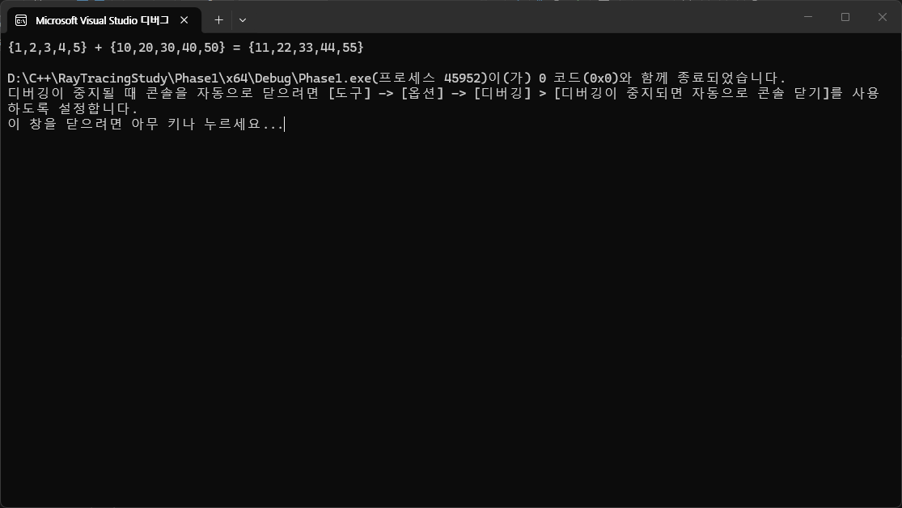

# RayTracingStudy
작성자 이종진
# CUDA 프로젝트 설정
CUDA Toolkit을 다운로드 합니다 - 
https://developer.nvidia.com/cuda-downloads  

제가 사용한 작업 환경은 아래와 같습니다.  
<span style="color:#617df8"> Windows11 / x86_64 / visual studio 2022 </span>

## 오류 해결 방법
저는 프로젝트를 기본 생성하면 생기는 ```kernel.cu```에서 2가지 오류가 발생했습니다.  
저와 비슷한 문제를 겪으신 분들이 쉽게 해결하시길 바라며 해결방법을 작성해보겠습니다.  
1.  
```c++
warning C4819: 현재 코드 페이지(949)에서 표시할 수 없는 문자가 파일에 들어 있습니다. 데이터가 손실되지 않게 하려면 해당 파일을 유니코드 형식으로 저장하십시오.
```
NVDIA의 모든 공식 문서를 유니코드 형식으로 인코딩하여 저장하는 방법은 추천하지 않습니다.  
대신 컴파일러가 CUDA 헤더파일의 문자를 UTF-8 형식으로 해석할 수 있도록 설정하세요.  
Visual Studio에서 아래 위치로 가세요.  
```프로젝트 - 구성 속성 - CUDA C/C++ - Command Line```  
추가 옵션에 아래의 명령을 추가합니다(빈칸에 적으시면 됩니다).  
```-Xcompiler="/utf-8"```  
2.  
아래 오류는 프로그램을 실행하면 콘솔에 적혀있는 로그입니다.  
```c++
the provided PTX was compiled with an unsupported toolchain.
```
역시 Visual Studio에서 아래 위치로 가세요.  
```프로젝트 - 구성 속성 - CUDA C/C++ - Device```  
여기서 ```Code Generation``` 항목을 보시면 됩니다.  
아래 사이트로 이동하세요.  
https://arnon.dk/matching-sm-architectures-arch-and-gencode-for-various-nvidia-cards/  
자신이 사용중인 그래픽 카드 모델을 찾아서 알맞은 값을 ```Code Generation```항목에 쓰면 됩니다.  
# 출력 결과



